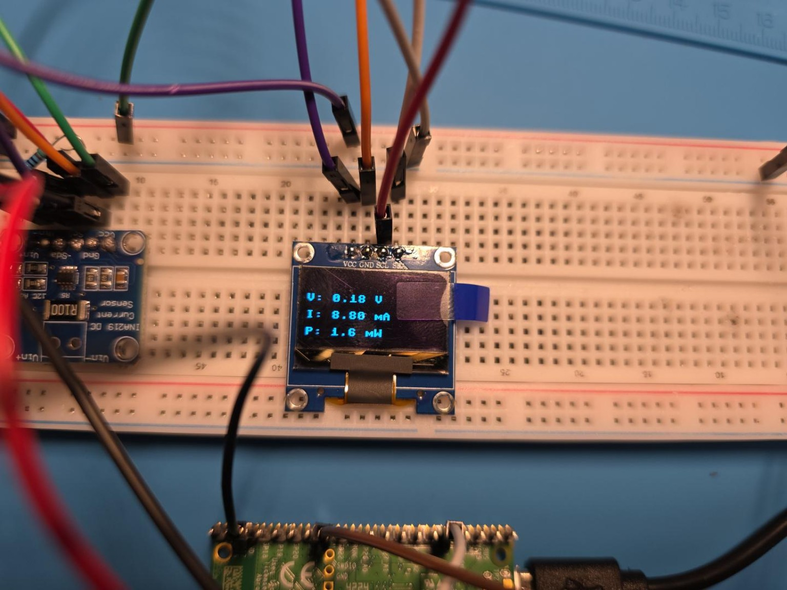
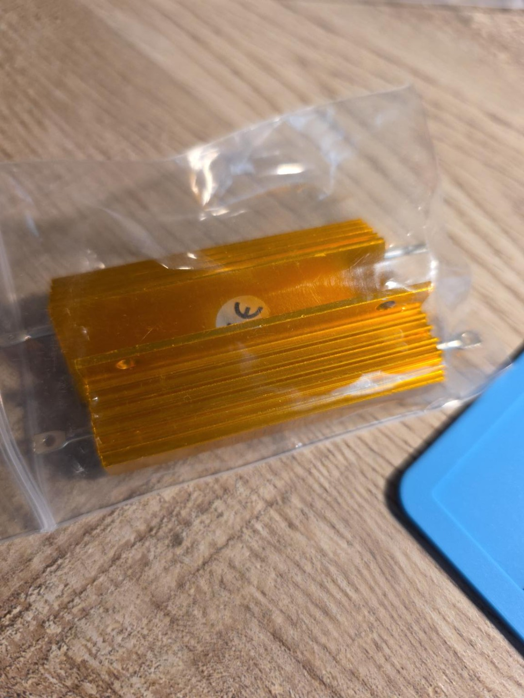
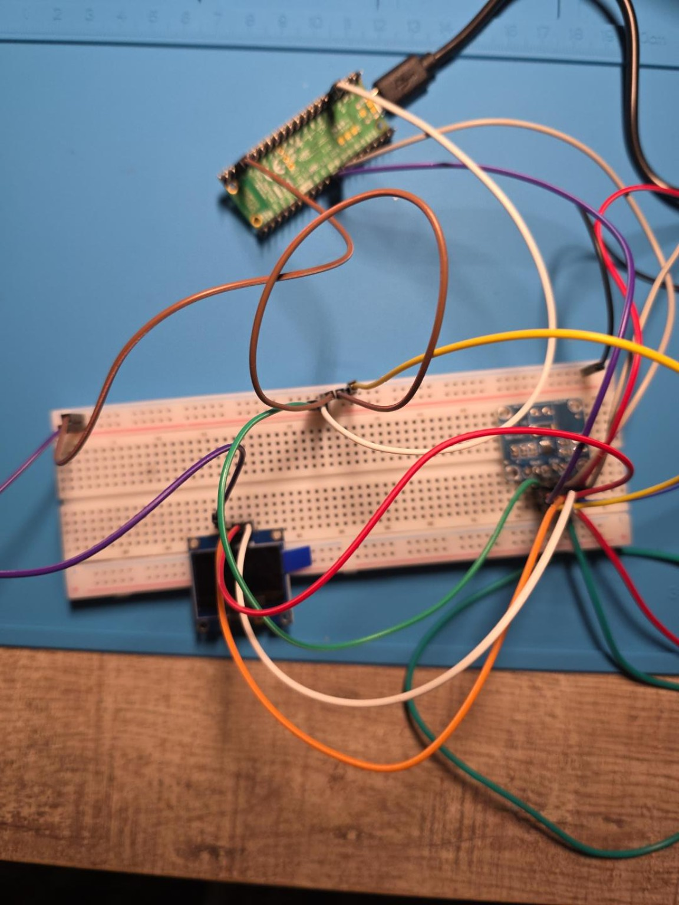
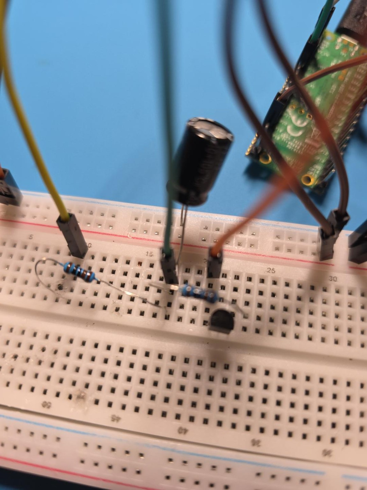

# Engineering Project Log

## Project objective

Build a Raspberry Pi Pico 2 W instrumentation platform that can measure DC voltage/current/power reliably, expose raw measurements for diagnosis, and extend into time-domain component characterization.

## 1. Shared I2C bus established

The OLED and INA219 were placed on a shared I2C bus using GP6 (SDA) and GP7 (SCL). A successful scan returned `[60, 64]`, corresponding to OLED `0x3C` and INA219 `0x40`.

## 2. Defective INA219 voltage channel isolated

An early live test reported approximately 0.18 V and 8.8 mA. The current was plausible for the original ~500 ohm load, but the voltage was not. A multimeter measured ~4.76 V directly between INA219 GND and VIN-, while the INA219 bus register still reported ~0.184 V. Lowering the supply to ~3 V changed the sensor reading only to ~0.12 V. Replacement modules were screened; the third module produced physically plausible voltage readings and became the working sensor.



## 3. Higher-current power-load stage

A 100 W, nominal 10 ohm aluminum power resistor was added to move from a few milliamps to several hundred milliamps. This exposed parasitic wiring resistance that was negligible during the low-current test.



## 4. Ground-reference and positive-path diagnosis

Under the larger load, INA219 GND differed from the supply-negative reference by ~86 mV. A star-ground redesign reduced the difference to ~0.2 mV. The positive path initially lost ~0.39 V at ~0.42 A. Parallel positive jumpers reduced this to ~0.10 V with two wires and ~0.076 V with three.

The key diagnostic method was to measure **voltage directly across each connection** and convert the drop into unwanted series resistance with `R = V/I`.

## 5. Voltage calibration

After stabilizing the wiring, five accepted calibration points were collected against a multimeter reference. A repeated high-voltage point was used to reject an earlier outlier. The final correction is:

```python
V_SLOPE = 0.98896
V_OFFSET = -0.03531
voltage = raw_voltage * V_SLOPE + V_OFFSET
```

An independent validation near 3.78 V matched the multimeter to within only a few millivolts.

## 6. Current-channel verification

A handheld-meter 10 A range reported an inconsistent ~0.43 A result. Rather than calibrating to it, the INA219 shunt was measured directly. The R100 shunt showed 30.1-30.2 mV, corresponding to ~0.301-0.302 A for a nominal 0.1 ohm shunt; the INA219 reported ~0.300 A. No current-scale correction was justified.

## 7. Layout consolidation and I2C recovery

The breadboard was reorganized to make room for expansion. The move introduced `OSError: [Errno 19] ENODEV`. A minimal I2C scan and wiring audit found INA219 VCC had accidentally been connected to the ground rail. Restoring VCC to the Pico 3.3 V rail recovered the device.



## 8. Transistor inventory and 2N2222 identification

A TO-92 transistor assortment was catalogued. No logic-level MOSFET was available, so the next extension used a 2N2222 for a low-current RC experiment.

The specific 2N2222 pinout was measured rather than assumed:

- Middle lead identified as Base using diode-test drops of ~0.600/0.603 V.
- Correct E-B-C orientation produced ~45.9 mV VCE in the low-current switch test.
- Reversing collector/emitter produced ~2.08 V.

Flat face toward observer: **Left = Emitter, Middle = Base, Right = Collector**.

## 9. RC transient analyzer

A separate low-current subsystem was added:

```text
GP0 ---- 1 kOhm ----+---- capacitor + ---- GP26 / ADC0
                    |
                    +---- 1 kOhm ---- C  2N2222
                                       E ---- GND
GP1 ---- 4.7 kOhm -------------------- B
capacitor - ------------------------------ GND
```

The capacitor is 1000 uF, 10 V. The nominal time constant for each 1 kOhm path is ~1.0 s.




### RC wiring diagnosis

The first run plateaued around 1.93 V and showed an apparent ~0.5 s time constant. The capacitor/ADC node was found to be touching the GP1/base-drive wiring, causing the transistor to conduct during charging.

After separating the nodes, charging reached ~3.29 V but the discharge path did not initially operate. GP1 was isolated and measured ~3.26 V when commanded HIGH, proving the Pico GPIO was healthy. Reconnecting the base-drive branch correctly restored the switch.

### Successful run

- Initial reset voltage: ~0.011 V
- Final charge voltage: ~3.29 V
- Charge at 1.0 s: ~2.055 V (theoretical 63.2% point ~2.08 V)
- Discharge at 1.0 s: ~1.278 V from ~3.291 V
- Estimated charge tau: ~1.03 s
- Estimated discharge tau: ~1.06 s
- Estimated capacitance: ~1050 uF

The OLED firmware was then extended to show a live charging curve, a live discharge curve, a side-by-side final plot, and the calculated time constant/capacitance.

## 10. Current state

The project now has two completed, complementary subsystems:

1. **Steady-state DC power analyzer** — calibrated voltage, independently verified current, power calculation, OLED UI, and raw serial diagnostics.
2. **RC transient analyzer** — automated BJT switching, Pico ADC acquisition, live exponential plots, time-constant extraction, and capacitance estimation.

## Next steps

- Integrate energy over time (mAh and Wh).
- Add repeatable load-step characterization.
- Improve final high-current interconnects.
- Reserve USB-A source characterization for late-stage integration.
