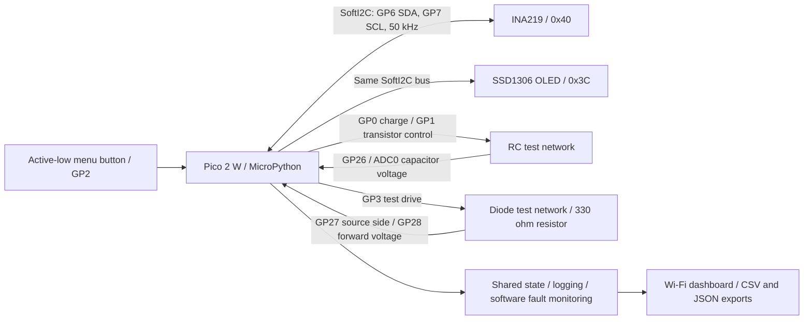

# System architecture

Reviewed against `firmware/main.py` and the project log on 4 September 2026. This is a functional overview, not a wiring schematic or a claim of a new hardware test.

## Power measurement path

The external load-current path is separate from the Pico's signal connections:

1. Bench supply positive → INA219 VIN+.
2. INA219 VIN− → test load.
3. Test-load return → supply negative directly.

Supply negative is the common reference. Pico and sensor low-current grounds reference the star-ground point; the high-current return is kept direct. The diagram above shows communication and control relationships, not electrical power flowing through the Pico or the Wi-Fi dashboard.

## Measurement boundaries

- ADC4 reads the MCU's internal die temperature, not ambient temperature.
- Guided Source Test captures V/I points manually. It does not drive an automatic load bank.
- A negative fitted source resistance is invalid; the new rejection guard still needs its documented on-device recheck.
- The diode PWM sweep is display-only. Settled DC measurements determine classification.
- Fault monitoring reports conditions in software; it does not disconnect power.
- The replacement OLED driver still requires the documented device recheck.

See the [README pin map](../README.md#pin-map) and [project log](PROJECT_LOG.md#verified-hardware-architecture) for the detailed implementation record.
